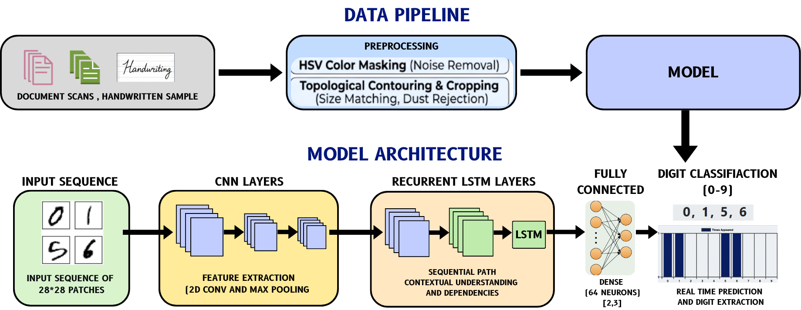
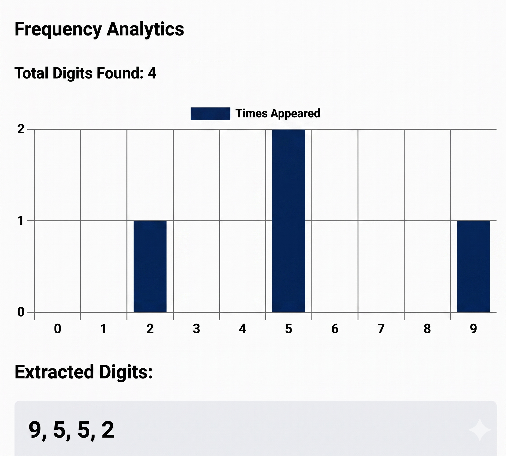
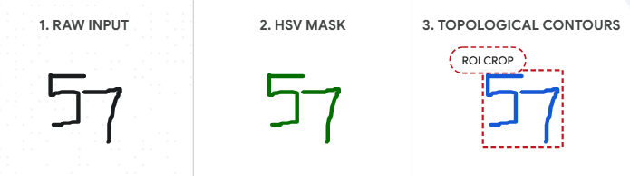
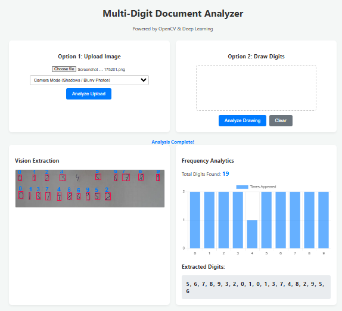

# 🧠 Handwritten Digit Analyzer ✍️

A real-time, deep learning-powered web application for processing messy, distorted handwriting.

🚀 [View Live Demo Here](https://handwritten-digit-analyzer.vercel.app/) 🚀

---

## 📌 Project Overview
Current OCR systems and standard digit classifiers often struggle with complex, unstructured documents containing background noise or grid lines. This project solves this limitation by implementing a robust data pipeline featuring HSV Color Masking and Topological Contouring to isolate valid digits. These isolated patches are then processed by a custom Convolutional Neural Network (CNN) trained on the EMNIST dataset to extract spatial features and accurately predict the final sequence.

## 📸 Project Screenshots

  
| Data Pipeline & Architecture | Live Frequency Analytics |
| :---: | :---: |
|  |  |
| The complete data flow from raw input to predicted output. | Real-time analytics of the extracted digits. |

| Preprocessing Example | Web Interface |
| :---: | :---: |
|  |  |
| HSV masking and precise topological cropping. | The responsive frontend dashboard. |

## ✨ Key Features
* Advanced Preprocessing: Utilizes OpenCV for HSV masking (eliminating false positives and background noise) and topological mapping to crop precise bounding boxes.
* Deep Learning Engine: Features a CNN that extracts spatial features from isolated 28x28 digit patches, achieving over 98% validation accuracy.
* FastAPI Microservice: The backend is designed as a lightweight, high-performance REST API capable of live data analytics.
* Interactive Frontend: A responsive JavaScript canvas and dashboard that visualizes the data pipeline and live prediction results.

## 🏗️ System Architecture
1. Frontend (Web Interface): Captures user input via document upload or canvas and sends it as an HTTP POST request.
2. Backend (FastAPI Server): Receives the raw image data and routes it to the AI Processing Unit.
3. AI Processing Unit: 
   * Cleans the image (Noise Removal & Size Matching).
   * Feeds isolated 28x28 patches into the CNN (2D Conv & Max Pooling).
   * Passes features to Dense layers (64 Neurons) for final 0-9 classification.
   * Returns a JSON response with recognized digits.

## 🚀 Local Installation & Setup

Follow these instructions to get the Handwritten Digit Analyzer running on your local machine for development and testing.

### Prerequisites
- Python 3.8 or higher installed on your system.
- Git installed.
- A modern web browser.

### 1. Clone the repository
Open your terminal or command prompt and run the following commands:

    git clone https://github.com/Harshita-Singhal/Handwritten-digit-analyzer.git
    cd Handwritten-digit-analyzer

### 2. Create a Virtual Environment (Recommended)
Creating a virtual environment ensures that the project dependencies do not conflict with your main system.

    # For Windows:
    python -m venv venv
    venv\Scripts\activate

    # For macOS / Linux:
    python3 -m venv venv
    source venv/bin/activate

### 3. Install Dependencies
Install all required Python libraries (FastAPI, TensorFlow, OpenCV, etc.) using the requirements file located in the backend directory:

    pip install -r backend/requirements.txt

### 4. Run the FastAPI Backend Server
Start the backend AI engine using Uvicorn. Make sure you are still in the main project folder when you run this:

    uvicorn backend.main:app --reload

The API will start running at http://localhost:8000. You can view the interactive API documentation and test the endpoints directly by visiting http://localhost:8000/docs.

### 5. Launch the Frontend UI
Because the frontend is built with vanilla JavaScript, HTML, and CSS, there is no complex build step required!
- Open your computer's file explorer.
- Navigate inside the frontend folder of the project.
- Double-click the index.html file to open it directly in your web browser.
- (Pro-Tip: If you are using VS Code, right-click index.html and select "Open with Live Server" for the best experience).

